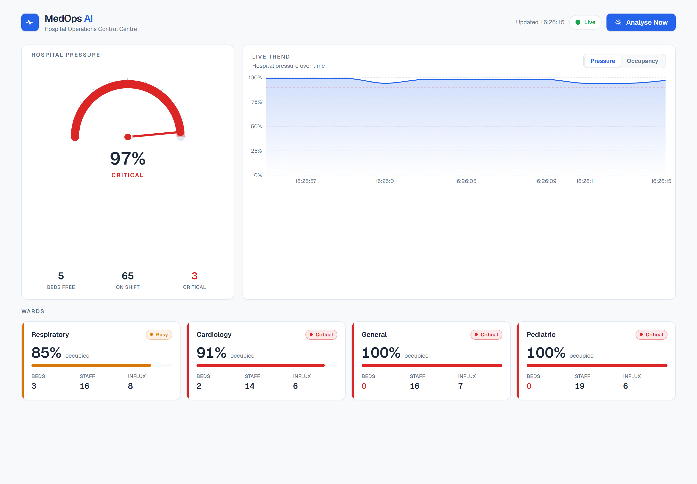
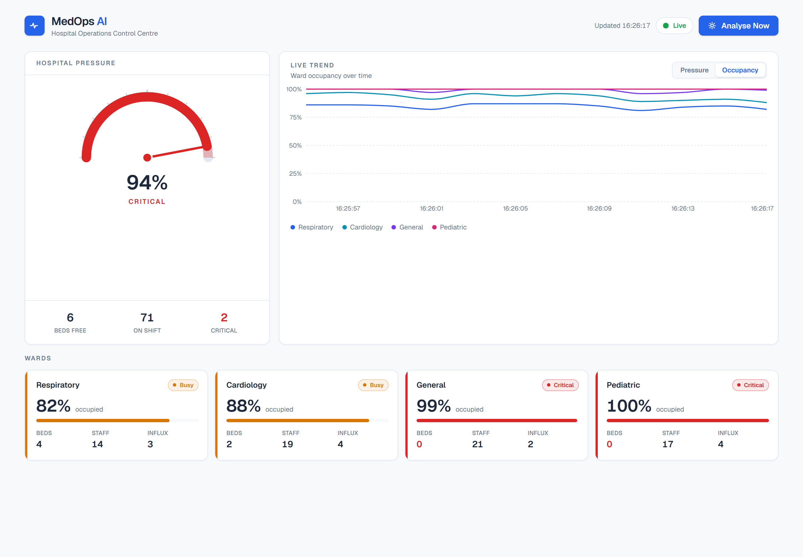
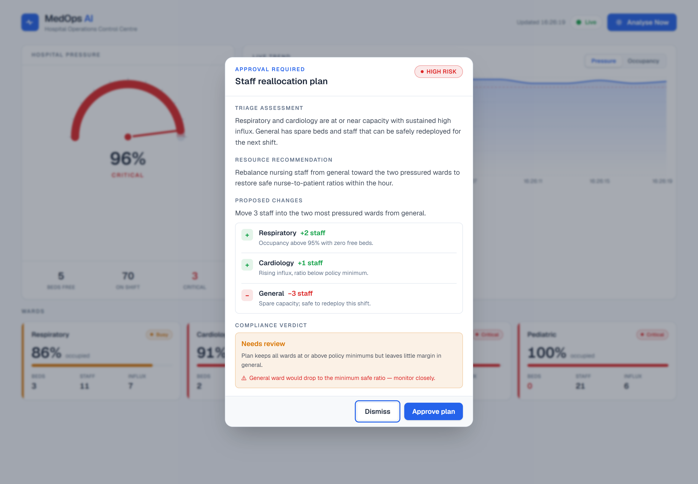
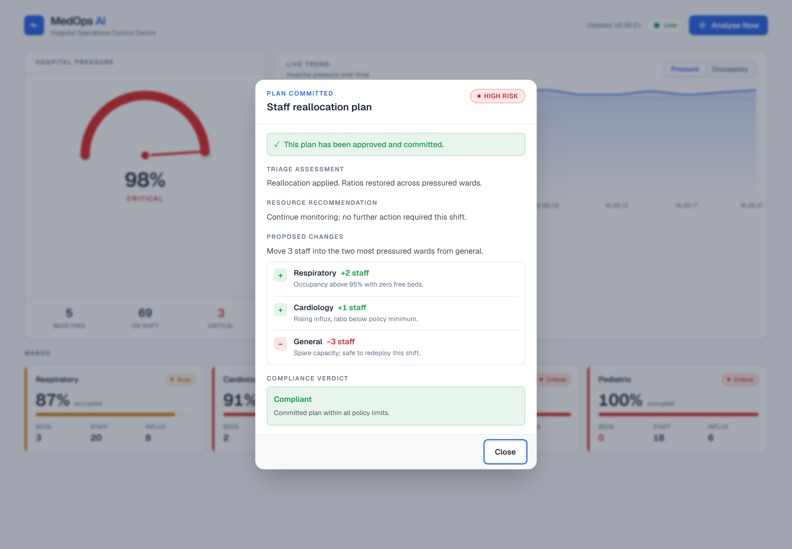
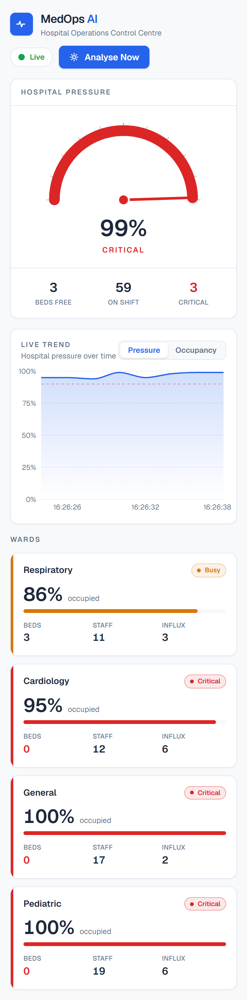
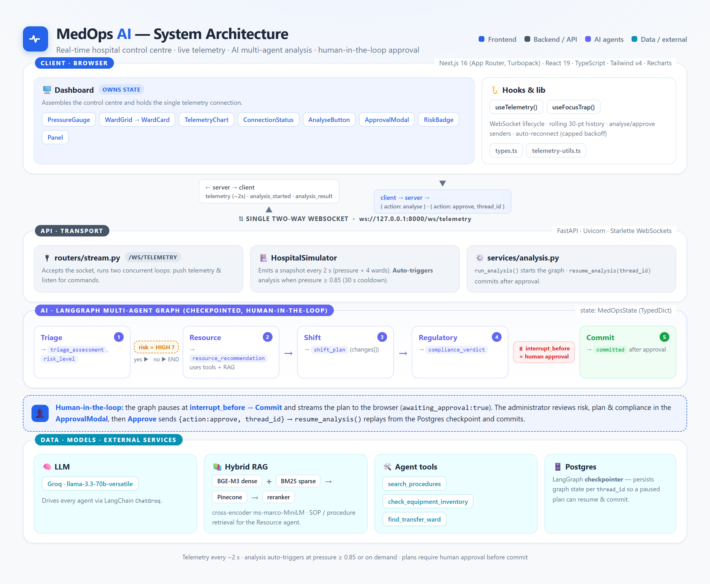

# MedOps AI — Hospital Operations Control Centre

A real-time hospital operations control centre. A FastAPI backend streams live
ward telemetry over a single WebSocket to a Next.js dashboard, where an
administrator can trigger an **AI multi-agent analysis** and **approve or reject**
proposed staff-reallocation plans (human-in-the-loop).

The frontend is a calm, clinical instrument panel: whites and blues are the
resting state, so amber (**busy**) and red (**critical**) genuinely stand out —
_restraint is the alerting mechanism_.



---

## Features

- **Live telemetry** over a single two-way WebSocket, pushed every ~2 s.
- **Analog pressure gauge** — an instrument-style manometer dial for overall
  hospital pressure, with a needle that sweeps across green/amber/red zones.
- **Colour-coded ward grid** — each ward tinted by occupancy
  (`<0.75` green, `0.75–0.9` amber, `>0.9` red); zero free beds is flagged red.
- **Live trend chart** (Recharts) with a **Pressure / Occupancy** toggle, fixed
  height to avoid layout shift.
- **AI multi-agent analysis** — triage → resource → compliance graph, triggered
  manually or auto-triggered when pressure is high.
- **Human-in-the-loop approval modal** — risk level, triage assessment, resource
  recommendation, the proposed staffing changes, and the compliance verdict,
  with **Approve** / **Dismiss** actions.
- **Resilient connection** — status indicator plus automatic reconnection with
  capped exponential backoff.
- **Responsive** from 375 px (single column) to desktop (multi-column grid),
  **accessible** (focus-trapped modal, Esc to close, semantic HTML, visible
  focus states), and tuned for **Core Web Vitals** (no layout shift, no heavy
  work on load).

---

## Screenshots

### Live dashboard — the pressure gauge, trend chart, and ward grid
The pressure dial sits at **90 % (busy/amber)**; General and Pediatric wards are
critical (red). The trend chart plots hospital pressure with a dashed 90 %
critical threshold line.


### Occupancy trend — per-ward series
Toggling the chart to **Occupancy** overlays a line per ward with a colour
legend, so you can compare wards over time at a glance.



### Human-in-the-loop approval
When the agent graph pauses for approval, the modal presents the AI's reasoning,
the proposed staffing changes (`+2` Respiratory, `+1` Cardiology, `−3` General),
and the compliance verdict (here **Needs review**, with a flagged concern).



### Plan committed
After **Approve plan**, the graph resumes and commits. The modal confirms the
committed state and shows the final **Compliant** verdict.



### Mobile (375 px)
Everything reflows to a single column. Here the gauge is **99 % critical** (red
needle) — the calm base makes that read instantly.

<p align="center">
  
</p>

---

## Architecture

The complete system — browser client, the single two-way WebSocket, the FastAPI
transport, the LangGraph multi-agent graph, and the data / model / external layer:



The socket is **two-way**:

**Server → client** (each message has a `type`):

| type               | when                    | payload                                     |
|--------------------|-------------------------|---------------------------------------------|
| `telemetry`        | every ~2 s              | `hospital_pressure`, per-ward vitals        |
| `analysis_started` | analysis begins         | `reason: "auto" \| "manual"`                |
| `analysis_result`  | graph pauses / commits  | risk, triage, plan, compliance, `awaiting_approval` |

**Client → server:**

| action    | payload                    | effect                          |
|-----------|----------------------------|---------------------------------|
| `analyse` | —                          | run a manual analysis           |
| `approve` | `thread_id`                | resume a paused plan and commit |

### AI multi-agent graph (LangGraph, human-in-the-loop)

A reading flows through four specialist agents behind a HIGH-risk gate; the graph
then pauses at `interrupt_before → Commit` until a human approves, and resumes
from the Postgres checkpoint to commit.

---

## Tech stack

**Frontend:** Next.js 16 (App Router, Turbopack) · React 19 · TypeScript
(strict, no `any`) · Tailwind CSS v4 · Recharts 3.

**Backend:** FastAPI · WebSockets · LangGraph (checkpointed human-in-the-loop
graph) · LangChain + Groq (LLM) · Pinecone + BGE-M3 hybrid RAG · Postgres
(LangGraph checkpointer).

---

## Getting started

### 1. Backend (FastAPI, port 8000)

Requires a `backend/.env` with `GROQ_API_KEY`, `PINECONE_API_KEY`, and
`DATABASE_URL` (Postgres). The first run downloads the BGE-M3 embedding model
(~2 GB), so startup takes a little while.

```bash
cd backend
python -m venv venv
venv\Scripts\activate            # Windows  (source venv/bin/activate on macOS/Linux)
pip install -r requirements.txt
python -m uvicorn app.main:app --host 127.0.0.1 --port 8000
```

Health check: `GET http://127.0.0.1:8000/health` → `{"status":"ok"}`.

### 2. Frontend (Next.js, port 3000)

```bash
cd frontend
npm install
npm run dev
```

Open <http://localhost:3000>. The WebSocket URL defaults to
`ws://127.0.0.1:8000/ws/telemetry` and is configurable:

```bash
# frontend/.env.local
NEXT_PUBLIC_WS_URL=ws://127.0.0.1:8000/ws/telemetry
```

---

## Frontend structure

```
frontend/src/
├─ app/
│  ├─ layout.tsx            Metadata, fonts, theme colour
│  ├─ page.tsx              Server-Component shell → <Dashboard/>
│  └─ globals.css           Tailwind v4 @theme design tokens, focus, reduced-motion
├─ lib/
│  ├─ types.ts              All WebSocket message types (server & client)
│  ├─ useTelemetry.ts       WebSocket lifecycle, rolling history, analyse/approve
│  ├─ useFocusTrap.ts       Reusable dialog focus trap (Tab cycle, Esc, restore)
│  └─ telemetry-utils.ts    Occupancy severity, palette, formatters
└─ components/
   ├─ Dashboard.tsx         Owns the hook; lays everything out
   ├─ ConnectionStatus.tsx  Live / Reconnecting / Error indicator
   ├─ PressureGauge.tsx     Analog manometer dial (SVG)
   ├─ WardGrid.tsx          Responsive grid + skeletons (no layout shift)
   ├─ WardCard.tsx          Colour-coded ward tile
   ├─ TelemetryChart.tsx    Recharts trend, Pressure/Occupancy toggle
   ├─ AnalyseButton.tsx     Manual-analysis trigger with loading state
   ├─ ApprovalModal.tsx     Human-in-the-loop dialog
   ├─ RiskBadge.tsx         Risk-level pill
   └─ Panel.tsx             Shared surface chrome
```

---

## Design tokens

| Token            | Value     | Use                    |
|------------------|-----------|------------------------|
| Background       | `#F7F9FB` | app canvas             |
| Surface          | `#FFFFFF` | cards / panels         |
| Hairline         | `#E2E8F0` | borders                |
| Text primary     | `#1E293B` | headings / values      |
| Text secondary   | `#64748B` | labels                 |
| Accent           | `#2563EB` | primary actions        |
| Calm / Busy / Critical | `#16A34A` / `#D97706` / `#DC2626` | status |
